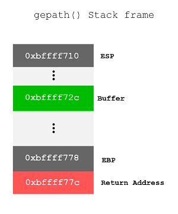

## Description

[Problem source](https://exploit-exercises.com/protostar/stack6/)

### Solution

This level is a step harder than the previous one. In this case we can't
simply overwrite the `return` address to point to our shellcode, because the
function `getpath()` checks for the `return` address on its stack frame and if
it starts with 0xbf it kills the program. This basically prohibits us from
jumping back to our shellcode, because our code lives on the stack, which starts
with 0xbf.

There are many solutions to this problem. First one that comes to mind is to
overwrite the `return` of the main function, instead of `getpath()`. This will
render the naive stack protection method ineffective. Second method, which I
have successfully executed at first, is to use the functions provided by gcc to
circumvent the protection method.

### First attempt (unsuccessful)

At this point I'm not using any ready-made tools such as metasploit.
Everything I do is done solely by gdb, python and GNU bintools.

So the first things first. Let's load up the program in `gdb` and look for the
address of our buffer and the offset from the buffer to the `return` address.

So in my case, the address of `return` is `0xbffff77c`. This address will differ
from one invocation to other, depending on the environment provided by the
execve call, but the offset will remain constant, no matter how the program is
invoked.

